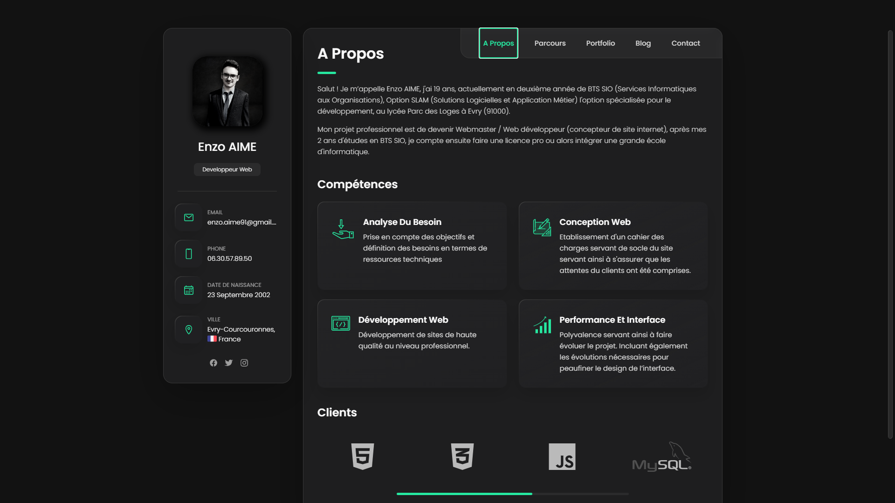

<!-- PROJECT PREVIEW -->
<br />
<p align="center">

  <h1 align="center">MonPortfolio</h3>

  <p align="center">
    <a href="https://enzo91080.github.io/Portfolio-Enzo-AIME/">Voir démonstration</a>
  </p>
</p>


### Screenshots

<p align="center">
  <p align="center">A Propos</p>
  
</p>
<p align="center">
  <p align="center">Parcours</p>

</p>
<br />
<p align="center">
  <p align="center">Portfolio</p>

</p>
<br />
<p align="center">
  <p align="center">Blog</p>

</p>
<br />
<p align="center">
  <p align="center">Contact</p>

</p>
<br />

<!-- GETTING STARTED -->
## Getting Started


<p>
    Si vous voulez cloner le projet et en faire votre portfolio personnel
</p>

<p>
    If you want to clone the project and make you personal portfolio
</p>
### Installation

1. Clone the repo
   ```
   git clone https://github.com/your_username_/Project-Name.git
   ```


